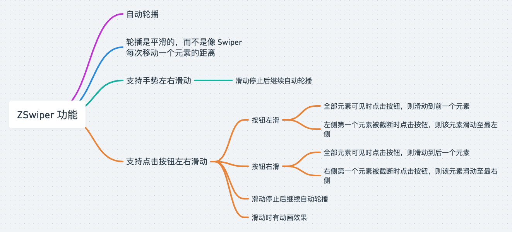

# ZSwiper


## 概述



## 安装及使用
安装
```shell
npm i vue-z-swiper
```

TODO

Vue2:
```js
// es module
import ZVueSwiper from 'vue-z-swiper/vue-z-swiper.es.js'

// umd
import ZVueSwiper from 'vue-z-swiper/vue-z-swiper.umd.js'
```

## 代码示例

```vue
<template>
  <div class="demo-page">
    <div class="demo-page__swiper-box">
      <z-swiper
          v-if="list.length"
          auto-play
          :list="list"
          :visible-length="4"
          :inner-height="55"
          :inner-width="270"
          :side-gap="16"
          :span-gap="16">

        <template #left>
          
        </template>

        <template #default="{ item }">
          <!-- item 父容器的宽高在 Swiper 内部已经计算好，开发者在这里的 item 样式可以使用 width: 100%、height: 100% 铺满外层 -->
          
        </template>

        <template #right>
          
        </template>

      </z-swiper>
    </div>
  </div>
</template>

<script>
import ZSwiper from './components/z-swiper.vue'
import IMG1 from './assets/images/model/1.png'
import IMG2 from './assets/images/model/2.png'
import IMG3 from './assets/images/model/3.png'
import IMG4 from './assets/images/model/4.png'
import IMG5 from './assets/images/model/5.png'
import IMG6 from './assets/images/model/6.png'
import IMG7 from './assets/images/model/7.png'
import IMG8 from './assets/images/model/8.png'

export default {
  components: {
    ZSwiper,
  },
  data() {
    return {
      list: [],
    }
  },
  async created() {
    // get data from server
    this.list = await new Promise((resolve) => {
      setTimeout(() => {
        resolve([
          IMG1,
          IMG2,
          IMG3,
          IMG4,
          IMG5,
          IMG6,
          IMG7,
          IMG8,
        ])
      }, 100);
    })
  }
}
</script>

<style lang="scss" scoped>
.demo-page {
  background: center/cover url("./assets/images/main-bg.jpeg");
  width: 100vw;
  height: 100vh;

  &__swiper-box {
    min-height: 55px;
    position: absolute;
    top: 80px;
  }

  &__item {
    box-sizing: border-box;
    border: 2px solid #FFFFFF;
    width: 100%;
    height: 100%;
    object-fit: cover;
    border-radius: 8px;
  }

  &__desc {
    margin-top: 14px;
    font-size: 13px;
    color: #FFFFFF;
    text-align: center;
    line-height: 20px;
  }
}
</style>

```

## API

### Props
该组件所有属性均为非响应式属性，所以开发者需要保证数组加载完成才渲染组件，不然可能会有异常。

| 参数             | 说明                                         | 类型          | 默认值      |
|----------------|--------------------------------------------|-------------|----------|
| list           | 数组，必填                                      | _Array\<any>_ | -        |
| visible-length | 可视元素个数，必填                                  | _number_    | -        |
| inner-height   | 播放栏高度，默认单位为 `px`，必填                        | _number_ \| _string_ | -        |
| inner-width    | 播放栏宽度，默认单位为 `px`，必填                        | _number_ \| _string_ | -        |
| span-gap       | 元素间距，默认单位 `px`                             | _number_ \| _string_      | `0`      |
| side-gap       | 两边间距，默认单位 `px`                             | _number_ \| _string_      | `0`      |
| auto-play      | 是否自动播放                                     | _boolean_   | `false`  |
| play-delay      | 滑动停止后再播放时间间隔，单位 `ms`                       | _number_    | `2000`   |
| play-immediate      | 组件渲染后是否立即自动播放，`auto-play` 为 `true` 时该属性才生效 | _boolean_   | `false`  |
| slide-animation-duration      | 点击左右按钮后滑动动画时长，单位 `ms`                      | _number_    | `300`    |


### Methods
| 名称           | 说明                         | 参数 |  返回值 |
|--------------|----------------------------|--|-----------------------|
| slideLeft   | 向左滑动 | - | - |
| slideRight |  向右滑动  | - | - |

### Slots

| 名称    | 说明   | 参数              |
|-------|------|-----------------|
| -     | 列表元素 | { item, index } |
| left  | 左按钮  | -               |
| right | 右按钮  | -               |
