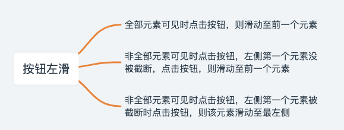

# vue-z-swiper 技术方案


## 前言
最近在做业务的时候，产品同学提了这样一个需求：


找了一遍开源没有合适的，于是决定自己写一个。大体思路主要参考 [Swiper](https://swiperjs.com)，监听 `touchmove` 事件，动态改变 `translateX` 实现滑动，在滑动到达边界的时候设置特定的 `translateX` 制造循环滑动效果。阅读文章时可以结合 [仓库代码](http://gitlab.zhenai.com/webapp/common/zanpm/za-vue-components/vue-za-swiper) 一起阅读。



此文接下来都会以这个 8 个元素的列表作为例子，假设 Swiper Container 容器可视元素是 4 个，讲解 ZSwiper 的手势滑动和按钮滑动功能。

## 初始化
如上图所示，为了避免向左滑动到最左边或者向右滑动到最右边的时候，滑动距离过大，而出现看不到元素的情况，我们需要拷贝一份数组分割成两部分，分别拼接在原来的首和尾。

```js
initDoubleList() {
  const mid = Math.floor((this.list.length / 2));
  this.halfLen = mid;
  this.doubleList = [ ...this.list.slice(mid), ...this.list, ...this.list.slice(0, mid) ]
}
```

接着计算出左边界的位置，将第 1 个元素，也就是索引 0 的元素，放到容器最左边。计算出右边界的位置，用于后面计算。

```js
initTranslateX() {
  const translateX = this.getDomTranslateX() - this.itemFullWidth * this.halfLen;
  this.setDomTranslateX(translateX);
  return Math.abs(translateX);
},

mounted() {
  this.initItemFullWidth();
  const initialTranslateX = this.initTranslateX();
  this.leftBorder = initialTranslateX;
  this.rightBorder = this.itemFullWidth * this.list.length + initialTranslateX;
}  
```

## 手势左右滑动


如上图所示，手势滑动思路比较简单，主要难点在于在滑动到达边界的时候，如何制造循环。结合上面第 2 张图看，比如我们一直向右滑，滑到右边界（RightBorder）的时候，将 `translateX` 置回左边界（LeftBorder），就可以产生向右无限滚动的效果。

```js
touchstart(evt) {
  const touch = evt.targetTouches[0];

  this.lastX = touch.pageX;
  this.translateX = this.getDomTranslateX();
}

touchmove(evt) {
  const touch = evt.targetTouches[0];
  const xDiff = touch.pageX - this.lastX;

  this.lastX = touch.pageX;
  this.setMove(xDiff);
}

setMove(xDiff) {
  this.translateX += xDiff;
  const translateXAbs = Math.abs(this.translateX);

  if (translateXAbs >= this.rightBorder) {
    this.translateX = -(this.leftBorder + (translateXAbs - this.rightBorder));
  } else if (translateXAbs <= this.leftBorder) {
    this.translateX = -(this.rightBorder - (this.leftBorder - translateXAbs));
  }

  this.setDomTranslateX(this.translateX);
}
```

## 点击按钮滑动
### 点击左滑
下面以点击左按钮滑动为例进行讲解。先看下整体流程，如下代码所示，用户点击按钮先触发 `handleSlide()`，先设置动画属性，然后调用 `_slidePrev()` 刷新 `translateX` 出现动画效果，滑动动画结束后再移除动画属性。

```js
mounted() {
  // 使用 throttle 避免用户快速连续点击导致动画出问题
  this.handleSlide = throttle(() => {
    Object.assign(this.$refs.swiperWrapper.style, {
      'transition-duration': `${ this.slideAnimationDuration }ms`,
    });

    this.translateX = this.getDomTranslateX();
    this._slidePrev();
    
    setTimeout(() => {
      Object.assign(this.$refs.swiperWrapper.style, {
        'transition-duration': '0ms',
      });
    }, this.slideAnimationDuration);

  }, this.slideAnimationDuration + 200, {
    trailing: false,
  });
},
methods: {
  getObserveEntries() {
    return new Promise((resolve) => {
      const observer = new IntersectionObserver((entries) => {
        observer.disconnect();

        resolve(entries);
      }, {
        root: this.$refs.swiperBody,
      });

      this.$refs.swiperItems.forEach((el) => {
        observer.observe(el);
      });
    })
  },
  _slidePrev() {
    this.getObserveEntries().then(((entries) => {
      const firstVisibleIndex = entries
        .findIndex((item) => item.intersectionRatio >= this.intersectionRatioThreshold)

      const isAllVisible = entries
        .filter((item) => item.intersectionRatio >= this.intersectionRatioThreshold).length === this.halfLen

      const targetIndex = firstVisibleIndex - 1
      // 下图标红的元素为 target
      const target = entries[targetIndex]

      const xDiff = isAllVisible ? this.itemFullWidthValue : this.itemWidthValue * (1 - target.intersectionRatio)
      this.translateX += xDiff
      this.setDomTranslateX(this.translateX)

      const translateXAbs = Math.abs(this.translateX)
      setTimeout(() => {
        if (translateXAbs <= this.leftBorder) {
          this.translateX = -(this.itemFullWidthValue * (targetIndex + this.list.length))
          this.setDomTranslateX(this.translateX)
        }
      }, this.slideAnimationDuration)
    }))
  },
}
```

接下来看看 `_slidePrev()` ，利用 [IntersectionObserver](https://developer.mozilla.org/zh-CN/docs/Web/API/IntersectionObserver) API 我们可以得知是容器刚好四个元素全部可见，


还是左侧第一个元素被截断了。根据不同情况计算位移 `xDiff`，然后与当前 `translateX` 进行运算，即可得到下一个位置的 `translateX`。


当左滑到到左边界的时候，需要将 `translateX` 重置到对应元素右边界的位置。比如这个例子当中 `targetIndex` 是 `3`，应该回到 `11` 的位置。由此可以推理出以下公式：
```js
if (translateXAbs <= this.leftBorder) {
  this.translateX = -(this.itemFullWidthValue * (targetIndex + this.list.length))
  this.setDomTranslateX(this.translateX)
}
```


有一个需要注意的点，边界计算要放到 `setTimeout` 中等到 `transition-duration` 被移除后才做。不然会因为 `translateX` 由右边界变到左边界这个过程加上动画，就会出现「转了一个圈」的奇怪动画效果。

### 点击右滑
右滑一般情况的计算方法基本与左滑一致，这里贴两张图展示下 `xDiff`，计算方法就不展开讲了。


接着讲下边界情况计算。以下图为例，滑动结束后超过了右边界了，这时我们的目标是要让索引为 `15` 的元素出现在 Swiper Container 最右边。但是 `translateX` 的定位是从 Swiper Container 最左边算起的，也就是说如果索引为 `12` 的元素出现在最左边，那边最右边的元素肯定是索引为 `15` 的元素。又由于边界问题，需要再向前移动一个数组长度到达索引 `4` 的位置。由此可以推理出以下公式：

```js
if (translateXAbs >= this.rightBorder) {
  // targetIndex: 15
  // halfLen: 4
  // 15 - 4 + 1 = 4
  this.translateX = -(this.itemFullWidthValue * (targetIndex - this.halfLen + 1 - this.list.length))
  this.setDomTranslateX(this.translateX)
}
```

